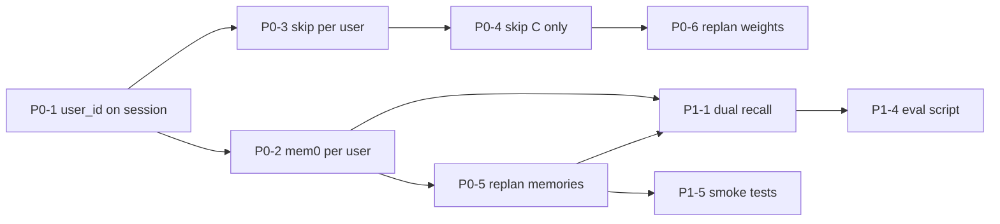

# Auracle — 个性化实施计划 & 评估 Checklist

> 状态：2026-06 — 由 personalization grill 收束  
> 前置：`auracle_memory_decision.md`（mem0 OSS）、`auracle_evaluation_design.md`（A/B/C 框架）

---

## 1. 设计共识（已拍板）

| # | 问题 | 决策 |
|---|------|------|
| 1 | 个性化单位 | 登录 **per-user**；demo 匿名 fallback `auracle_anonymous` |
| 2 | skip 权重按 condition | **A** 无跨 session；**B** 仅 session 内 replan；**C** 历史 skip + mem0 |
| 3 | 用户绑定 | **评估强制登录**；日常 demo 允许匿名 |
| 4 | 写入 | **评估**：标准化脚本保证可复现 mem0 写入；**产品**：后端规则补 coverage |
| 5 | 读取 | **replan 读 mem0**；DJ cue 暂用开场 `mem0Context` 快照 |
| 6 | recall | **双 query**：情境 + 通用口味，合并去重 |
| 7 | 感知层 | **曲目变化优先** — C 相对 B 必须体现在 `played_track_ids`，不只 DJ 口播 |

### 目标态数据流

```
写入 (C only)                    读取 (C only)
─────────────────                ─────────────────
脚本 mood/skip  ─┐               recall(mood+scene) ──┐
后端规则        ─┼─► mem0       recall(general)    ──┼─► Flow / replan
record_pref     ─┘               skipRateByEnergy   ──┘       │
skip 事件 ───────► session_events (per user_id)              ▼
                                                        Step1 检索降权
                                                        Step2 Flow 排序
                                                        → played_track_ids
```

---

## 2. 当前差距（相对共识）

| 优先级 | 差距 | 现状 |
|--------|------|------|
| **P0** | 用户隔离 | mem0 `userId` 硬编码 `auracle_user`；`skipRateByEnergy` 全局聚合 |
| **P0** | condition 泄漏 | skip 权重 A/B/C 全开，污染 B ablation |
| **P0** | replan 不读记忆 | `plan.ts` `replan()` 硬编码 `memories: ""` |
| **P0** | auth 未接入 session | `POST /sessions` 不解析 Bearer token |
| **P1** | recall 过窄 | 单 query `music preferences for {mood} {scene}` |
| **P1** | mem0 对歌单影响弱 | 仅 Flow prompt 软约束，C vs B 歌单可能几乎相同 |
| **P1** | 写入不可靠 | 主要靠 DJ `record_preference`，覆盖率低 |
| **P2** | session 内不回灌 | `mem0Context` 创建后冻结；cue 不注入新偏好（P2 任务） |
| **P1+** | 无结构化口味 | 仅 mem0 文本；无 genre/artist/album/track 实体偏好 → 见 `auracle_structured_taste_design.md` |

---

## 3. 实施计划

### Phase 0 — 评估可信度（阻塞用户研究）

**目标**：A/B/C 实验臂干净；被试画像不串台；replan 在 C 条件使用记忆。

> **状态 2026-07-01**：P0-1…P0-7 **已实现**。编排位于 **`agent-harness`** 服务；`session/` 已按 lifecycle / planning / delivery 拆分（见下表路径）。`ANONYMOUS_USER_ID` 从 `@auracle/shared` 导出。

**`agent-harness/src/session/` 模块（2026-07）**

| 目录 / 文件 | 职责 |
|-------------|------|
| `runtime.ts` | HTTP 门面（`SessionRuntime`） |
| `tool-runner.ts` | DJ tool 分发（Lane 1） |
| `state.ts` | `SessionStore` + `SessionState` |
| `queries.ts` | 只读 snapshot / registration |
| `flow.ts` | 流程 step 目录（`session-flow.test.ts` 守护） |
| `lifecycle/` | create、now-playing、extend、skip-swap、host-mode |
| `planning/` | replan、playlist-feedback、mood-scope |
| `delivery/` | `pushQueueUpdate`、cue（Lane 3 推送） |

| ID | 任务 | 涉及文件 | 完成标准 |
|----|------|----------|----------|
| ✅ P0-1 | Session 绑定 `user_id` | `agent-harness/{server.ts,routes/session-route-middleware.ts,session/runtime.ts,session/lifecycle/create.ts,session/state.ts,memory-service-client.ts}` | `POST /sessions` 读 Bearer → `resolveSessionUser`；无 token → `auracle_anonymous`；无效 token → 401。web `createSession` 带 `Authorization` |
| ✅ P0-2 | mem0 per-user | `memory-service/memory/client.ts`, `server.ts` | `recall(query,userId)` / `remember(fact,sessionId,userId)`；`search`/`add` 用传入 id，删除硬编码 `auracle_user` |
| ✅ P0-3 | skip 按 user 聚合 | `memory-service/events-db.ts`, `server.ts` | `session_events.user_id` 必填；`skipRateByEnergy(userId, recentSessions)` 按列过滤 |
| ✅ P0-4 | skip 仅 C 生效 | `agent-harness/session/planning/replan.ts`, `session/lifecycle/create.ts` | `condition !== "C"` 时 `energyWeights = undefined`、不调 `skipRateByEnergy`、`memories = ""` |
| ✅ P0-5 | replan 传 memories | `agent-harness/session/planning/replan.ts`, `music-engine/flow/plan.ts` | `applyReplan` 传 C-only `state.mem0Context`；`replan()` 加 `ReplanInput.memories`，删除硬编码 `memories: ""` |
| ✅ P0-6 | replan 传 energyWeights | 同上 + `session/state.ts` | 权重存于 `SessionState.energyWeights`，replan 复用初始 plan 同一份 |
| ✅ P0-7 | 评估环境强制登录 | `apps/web` (`VITE_EVAL_MODE`), `auracle_evaluation_design.md` §实验 SOP | 被试预注册；无效 Bearer → 401；评估部署隐藏 guest；禁止共用 browser profile |

**P0 验收测试（自动化）** — `pnpm -r test` 全绿（agent-harness / music-engine / memory-service）

- [x] 用户 A、B skip 隔离：`skipRateByEnergy(userId)` 按 user 过滤（memory-service 单测）；C-only 传权重（agent-harness 单测）
- [x] Condition B 不调 `skipRateByEnergy`、`energyWeights` `undefined`、`memories` `""`（agent-harness 单测）
- [x] C replan 请求体含非空 `memories` + 同一 `energyWeights`；B replan 二者皆空（agent-harness 单测）
- [x] `record_preference`/`remember` 串接 `userId`；**异 user mem0 不可见已线下验证**（2026-06-25 smoke：real Qdrant+mem0+Gemini，userA recall 见己事实、userB recall 空；`POST /sessions` Bearer A → `mem0_context` 含 A 事实，B → 空）

---

### Phase 1 — 让 C 可观测（评估前强烈建议）

**目标**：第二次 session 或 replan 后，C 的 `played_track_ids` 与 B 有可检测差异。

| ID | 任务 | 涉及文件 | 完成标准 |
|----|------|----------|----------|
| ✅ P1-1 | 双 query recall | `memory/client.ts` 或 `server.ts` | `recallForIntent(userId, mood, scene)` 合并两路 topK，去重 |
| ✅ P1-2 | Flow prompt 强化 | `music-engine/flow/gemini.ts` | `User profile` 段明确写「优先满足以下偏好选曲」；可选：违反偏好需在 reason 解释 |
| ✅ P1-3 | 后端写入规则 | `agent-harness/session/lifecycle/now-playing.ts` | C only：同 energy 连续快速 skip ≥2 → 写一条高信号 mem0 事实；避免单次 skip 噪声 |
| P1-4 | 评估脚本固化 | 本文 §4 | 每场 C 至少 1 条可复现写入（mood replan）；配对 C vs B 可分析 |
| P1-5 | smoke test | `memory-service/test/` | 集成测试：mock mem0 有「prefers lighter energy」→ C plan 平均 energy < 同 intent 的 B |

**P1 验收（人工 smoke，评估前 1 天）**

- [ ] 同一账号 QA：**两次 C** 之间第二次 plan 与第一次有差异（跨 session）  
- [ ] 同一账号：**C vs B** 配对，replan 后曲目或能量可区分  
- [ ] mem0 / Qdrant 不可用 → 降级为 B 行为，session 仍可完成  

---

### Phase 2 — 体验与产品（post-demo / 有余力）

> **产品 IA**：Station（当次 session）与 **Sound 品位工程**（L1 结构化 + L2 行为 + L3 mem0）边界见 `auracle_sound_ia.md`。前端 Sound 页骨架已落地；数据与编辑能力随 Epic #3（S1–S4）接入。

| ID | 任务 | 说明 |
|----|------|------|
| P2-0 | Sound 品位工程 UI | `SoundScreen` + 账号入口；S2 API 接入 Your taste / Learned / Signals |
| P2-1 | `remember()` 后更新 `state.mem0Context` | 同 session DJ 口播可引用新偏好 |
| P2-2 | cue / `tracklist_updated` 注入偏好摘要 | 对齐 `auracle_memory_decision.md` |
| P2-3 | mem0 反哺 Step1 检索 | 用 recall 改写 query 或对 top-24 二次 rerank |
| P2-4 | plan cache 失效策略 | `remember` 后按 `userId + recall hash` bust cache |
| P2-5 | skip 权重分 scene/mood | 替代全局 energy 聚合 |

---

### 依赖顺序



**建议排期**

| 阶段 | 工时粗估 | 里程碑 |
|------|----------|--------|
| P0 | 1–2 天 | 可跑干净 A/B/C ablation |
| P1 | 1–2 天 | C vs B 歌单差异可演示 |
| P2 | 按需 | 产品 polish |

---

## 4. 评估 Checklist

### 4.1 研究启动前（一次性）

**基础设施**

- [ ] Qdrant 运行，`/health` 或 mem0 探活正常
- [ ] `GEMINI_API_KEY`、Flow 模型、embed 模型配置正确
- [ ] P0 代码已合并并通过 §3 P0 验收测试
- [ ] P1-1 双 query recall 已上线（至少评估组启用）
- [ ] 为 18 名被试预创建 **独立账号**（`participant_01` … `participant_18`）
- [ ] Latin Square 条件顺序表打印/分发（6 序列 × 3 人）
- [ ] 清空或隔离测试数据：评估前导出 baseline Qdrant snapshot，再 wipe `auracle_memories` collection

**材料**

- [ ] 标准化小抄（§4.3）打印 18 份
- [ ] Likert 问卷终稿（4 维度 + 条件盲测确认题）
- [ ] 实验员话术：如何按住 talk 键、何时念脚本、不提示「记忆」或「AI」

**Smoke（评估前 24h，QA 账号 `participant_00`，非正式被试）**

- [ ] **两次 C**（同账号、同 mood/scene）：第二次 `mem0_context` 非空且歌单与第一次有差异 — 验证跨 session 链路  
- [ ] 同账号跑一次 **B**：确认无 mem0 写入、检索无 `energyWeights`  
- [ ] 跑一次 **A**：第 3 首 mood 后无 `replan` 事件  

> 正式 18 人研究：每人 A/B/C **各一次**，见 `auracle_evaluation_design.md`「C 效应说明」。

---

### 4.2 每名被试（约 75–90 分钟）

| 步骤 | 动作 | 勾选 |
|------|------|------|
| 1 | 记录被试 ID、条件顺序（Latin Square） | ☐ |
| 2 | 登录 **该被试专属账号**（禁止共用） | ☐ |
| 3 | **Session 1**（按顺序表条件 A/B/C） | ☐ |
| 4 | 填写问卷（session 1） | ☐ |
| 5 | **Session 2**（下一条件） | ☐ |
| 6 | 填写问卷（session 2） | ☐ |
| 7 | **Session 3**（最后一条件） | ☐ |
| 8 | 填写问卷（session 3） + 总评（可选） | ☐ |
| 9 | 导出该 user 的 `session_events` + session_id 列表 | ☐ |
| 10 | 间隔休息 ≥5 min（避免 Live 疲劳） | ☐ |

**固定 session 参数（三条件一致）**

- mood / scene / duration：全被试相同（例如 `calm` + `study` + 25 min）
- 浏览器：Desktop Chrome，耳机
- host_mode：默认（由 scene 推断），脚本不要求改 mode

---

### 4.3 每个 Session 内（实验员小抄）

**所有条件**

| 时机 | 被试说 | 预期 |
|------|--------|------|
| 开场 | （无） | DJ opening，8 首开始 |
| 第 5 首曲间 | 「下一首」 / “Skip” | `skip_track`；记录 skip_latency |

**B / C 额外**

| 时机 | 被试说 | 预期 |
|------|--------|------|
| 第 3 首曲间（break 窗口） | 「来点更轻的」 / “Something lighter” | `mood_change` → replan；剩余曲 energy 偏轻 |

**C 条件（本场唯一一次 C session）**

| 时机 | 被试说 | 预期 |
|------|--------|------|
| 第 3 首后 | （同 B） | replan 使用开场 `mem0_context`（有历史则非空）+ P0 后传入 Flow |
| 第 5 首后 skip | 「下一首」 | 若 <60s，写 skip 事实进 mem0（**下一场** C 或 QA 第二次 C 才生效） |
| 可选曲间 | 「我更喜欢爵士」 | `record_preference`（bonus） |

**A 条件**

| 时机 | 被试说 | 预期 |
|------|--------|------|
| 第 3 首曲间 | 「来点更轻的」 | DJ 口头回应；**歌单不变**（无 `replan` 事件） |

---

### 4.4 Session 后数据核对（实验员 / 分析）

**每条 session 必填元数据**

```text
participant_id:
session_id:
condition: A | B | C
user_id:
started_at:
mood / scene:
```

**`session_events` 必查事件**

| 事件 | A | B | C |
|------|---|---|---|
| `session_created` | ☐ | ☐ | ☐ |
| `replan`（第 3 首后） | 不应出现 | ☐ | ☐ |
| `skip_latency`（第 5 首后） | ☐ | ☐ | ☐ |
| `record_preference` | 无 | 无 | 可选 |

**C 条件 mem0 核对**

- [ ] 第 3 首后 `replan` 事件存在；C 相对 B 的 **replan 后** `played` 序列可区分（能量或曲目）
- [ ] 若被试 **曾有** mem0 历史（QA 第二次 C、或回访）：`session_created` 响应 `mem0_context` 非空  
- [ ] 本场快速 skip 后：Qdrant / recall 可见 skip 事实（供**后续** session，非本场初始 plan）
- [ ] **配对**：同被试 C vs B 的 `played_track_ids[]` 至少一项可观测差异（Jaccard 或 Δenergy）

---

### 4.5 客观指标导出（分析阶段）

从 `session_events` 重建 `played_track_ids[]` 后计算（见 `auracle_evaluation_design.md`）：

| 指标 | 组间对比 | 个性化相关假设 |
|------|----------|----------------|
| Energy Smoothness | A vs B vs C | B/C < A |
| Arc Adherence | A vs B vs C | B/C < A |
| **C vs B 歌单 Jaccard** | 同被试配对 C 与 B | C 与 B 重叠度；结合 replan 后序列 |
| **C replan 后 Δenergy** | 仅 C | 第 3 首打断后剩余曲平均 energy 变化 |
| Skip rate by energy | QA 第二次 C 或回访用户 | 高 skip 能量档在后续 session 出现率下降 |

**主观**

- [ ] Personalization 维度：C 均值 > B > A（方向性假设，样本小做描述统计）
- [ ] Relevance：C ≥ B > A

---

### 4.6 故障降级

| 症状 | 处理 | 是否纳入分析 |
|------|------|----------------|
| mem0/Qdrant 挂 | 自动降级；当次 C 记为 **C-degraded** | 单独标注，不与其他 C 混 |
| Live 断线 | 重连同一 session_id；完不成则记 **abort** | 排除或重做 |
| DJ 未调 `record_preference` | 正常；依赖 replan + skip 规则写入 | 不排除 |
| replan 失败（`replan_failed`） | 实验员记日志；可选重试 mood 打断 | 标注 |

---

## 5. 文档同步状态

以下修订 **已写入** `auracle_evaluation_design.md` 与 `auracle_memory_decision.md`（2026-06）：

1. Condition A/B/C 与 skip 权重、mem0、per-user 边界  
2. 评估强制登录；日志 `event_type` 与代码对齐  
3. 客观指标：C vs B Jaccard、replan Δenergy  
4. memory 文档：replan 读侧 P0、cue 回灌 P2、双 query P1  

---

## 6. 相关文档

- 记忆方案：`auracle_memory_decision.md`  
- **产品 IA（Station / Sound 品位工程）**：`auracle_sound_ia.md`  
- **结构化口味（taxonomy / slug / 换库）**：`auracle_structured_taste_design.md`  
- 评估框架：`auracle_evaluation_design.md`  
- Gemini / mem0 集成：`auracle_gemini_integration.md`  
- API：`auracle_api_protocol.md`  
- 实现 Epic：[GitHub #3](https://github.com/thinkinbig/auracle-dj-radio/issues/3)
