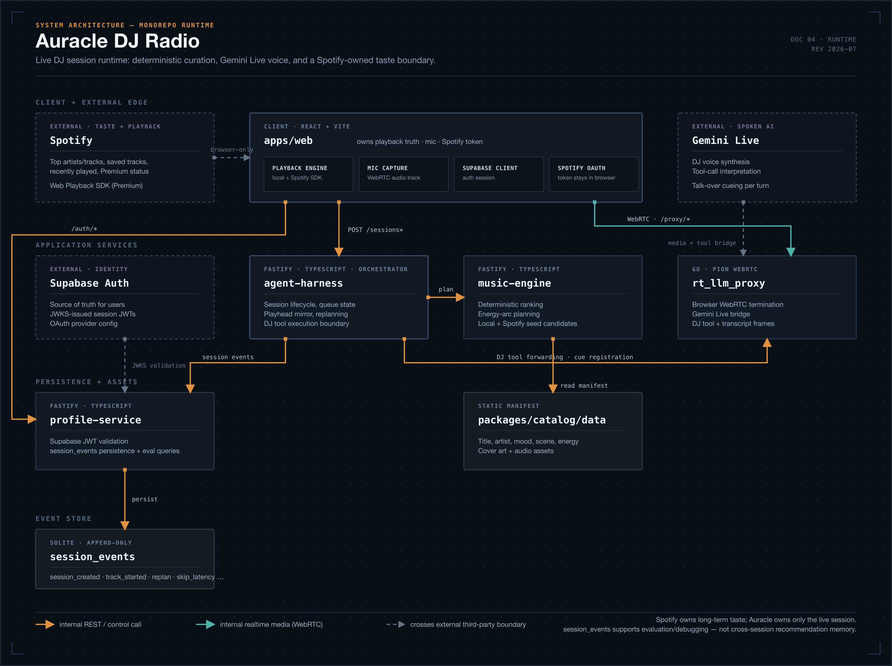
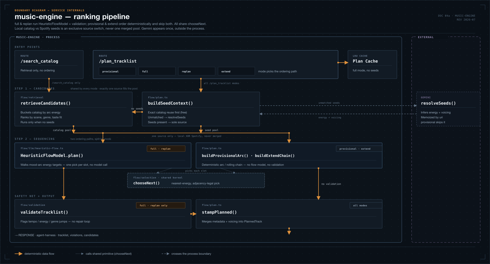
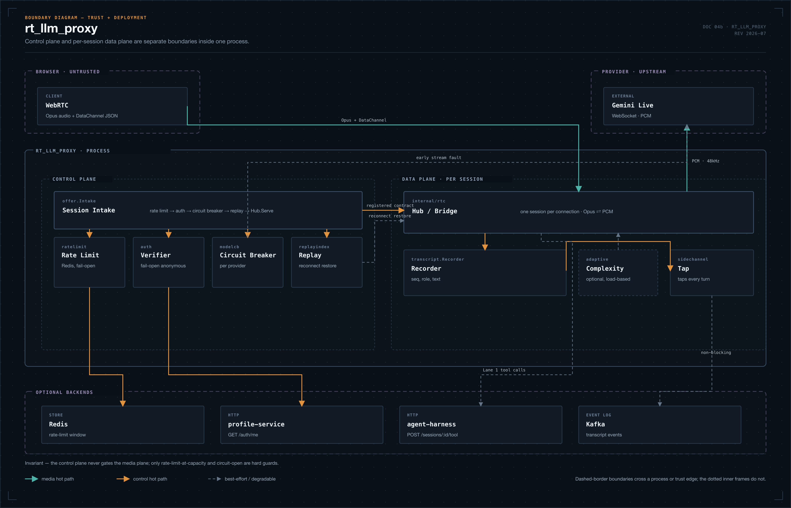

# Auracle Technical Report

> Draft status: first technical report draft.
> Project: Auracle DJ Radio.

## Abstract

Auracle is a web-based AI radio DJ system that combines live spoken interaction, deterministic music curation, Spotify-derived personalization, and adaptive queue control. The system is designed around a live listening session: a user selects an initial mood and scene, optionally connects Spotify for taste signals, and then listens to a dynamically hosted station where an AI DJ speaks over music intros, responds to user commands, and can replan the remaining queue.

The core technical challenge is coordinating real-time conversational audio with reliable music playback and explainable queue construction. Auracle addresses this by separating responsibilities across multiple services. A React web client owns playback, microphone capture, Spotify OAuth tokens, and the user interface. A TypeScript agent harness owns session state, queue mutation, Gemini tool handling, and event recording. A deterministic music engine ranks either the local catalog or, when the listener has selected Spotify, their gathered Spotify seeds — the two sources are never mixed within a session. A Go real-time proxy terminates WebRTC from the browser and bridges audio/data channels to Gemini Live. A profile service validates Supabase authentication and persists session events for analytics and evaluation.

This report describes the system architecture, key design decisions, data model, runtime protocols, personalization boundary, evaluation design, deployment constraints, and current limitations.

## Contents

1. [Introduction](#1-introduction)
2. [System Goals](#2-system-goals)
3. [High-Level Architecture](#3-high-level-architecture)
4. [Frontend and Playback Layer](#4-frontend-and-playback-layer)
5. [Music Engine](#5-music-engine)
6. [Agent Harness](#6-agent-harness)
7. [Gemini Live and Real-Time Proxy](#7-gemini-live-and-real-time-proxy)
8. [Authentication and Storage](#8-authentication-and-storage)
9. [Personalization Boundary](#9-personalization-boundary)
10. [API and Runtime Data Flow](#10-api-and-runtime-data-flow)
11. [Evaluation Design](#11-evaluation-design)
12. [Deployment Model](#12-deployment-model)
13. [Implementation Notes](#13-implementation-notes)
14. [Limitations](#14-limitations)
15. [Future Work](#15-future-work)
16. [Conclusion](#16-conclusion)

## 1. Introduction

Most music streaming systems separate music selection from presentation: recommendation algorithms choose tracks, while playback clients render them. Auracle explores a different product shape: a radio-like session where track selection, DJ hosting, and listener interaction are treated as one live experience.

The target experience is not simply a chatbot attached to a playlist. The DJ should understand the current session, speak at appropriate moments, avoid stale comments after track skips, and alter only the remaining queue when the listener asks for a mood change or gives feedback. The music system should also remain dependable: first playback should be fast, all queued tracks should be playable, and the curation logic should be inspectable enough to evaluate.

Auracle therefore uses a hybrid AI architecture:

- Deterministic code handles catalog retrieval, energy arcs, queue construction, session state, and playback control.
- Gemini Live handles spoken DJ interaction and natural-language tool calls.
- Spotify provides long-term taste signals, but Auracle does not store raw Spotify history or maintain a second long-term taste profile.
- Persistent event logs support evaluation and debugging, but do not drive future-session recommendation.

This separation keeps live AI behavior expressive while preserving deterministic control over the parts of the system that affect playback correctness.

## 2. System Goals

Auracle has four technical goals.

### 2.1 A coherent live DJ experience

A session should feel intentionally hosted, not like isolated generated utterances. The DJ should cue tracks, talk over intros, respond to user intent, and avoid promising actions that the backend cannot perform.

### 2.2 Controllable music curation

The system should support mood, scene, energy shape, genre diversity, and session-scoped adaptation while keeping the ranking logic transparent enough for objective evaluation.

### 2.3 Privacy and token boundaries

Spotify OAuth tokens stay in the browser. The server receives a compact taste summary and optional session-scoped seed tracks, not raw top-track history or saved-library dumps as durable user memory.

### 2.4 Demo-scale deployability

The project currently targets a single-machine or small demo deployment rather than serverless infrastructure. Real-time WebRTC audio and in-memory session state are treated as long-running service concerns.

## 3. High-Level Architecture

Auracle is implemented as a monorepo with a multi-service runtime.

The runtime separates responsibility into five services around a single browser client:

- `apps/web` — React UI, playback, microphone capture, and the Spotify/Supabase clients. It is the only process holding the Spotify OAuth token and the only one with direct access to the listener's audio devices.
- `agent-harness` — session lifecycle, queue state, the playhead mirror, DJ tool handling, and replanning.
- `music-engine` — deterministic catalog retrieval and energy-arc planning over either the local catalog or Spotify seeds (exclusive per session), invoked by agent-harness.
- `profile-service` — Supabase JWT validation and `session_events` persistence for evaluation.
- `rt_llm_proxy` — a Go service that terminates browser WebRTC and bridges audio/data channels to Gemini Live, forwarding DJ tool calls back to agent-harness.

The frontend communicates with three backend surfaces:

- `/sessions*` for session creation, snapshots, feedback, cueing, and now-playing updates.
- `/auth/*` for Supabase-backed identity verification through profile-service.
- `/proxy/*` for WebRTC SDP offer exchange with the real-time proxy.

In local development Vite proxies these paths. In Docker deployment, nginx serves the SPA and static catalog assets while reverse-proxying backend routes.

## 4. Frontend and Playback Layer

The web app is a React/Vite application. It owns user interaction, playback, microphone capture, and Spotify integration. This ownership is intentional: only the browser can safely hold the Spotify OAuth token and only the browser has direct access to the user's audio output device and microphone.

Auracle supports two music backends:

- Local catalog playback through browser audio.
- Spotify playback through the Spotify Web Playback SDK for Premium users.

The queue model is source-selected rather than mixed: choosing Spotify makes the listener's gathered Spotify library the session's exclusive source, and local mode uses only the local catalog. A session queue is never a blend of the two. Each track still carries enough metadata for display and DJ cueing, and the playback layer delegates to the correct backend per track — a per-session source switch, not a per-track one.

The DJ voice is conceptually separate from the music source. Over local tracks, music and DJ voice share the browser audio graph, allowing precise ducking. Over Spotify tracks, the Spotify device owns music playback, so volume ducking is less exact. This is an accepted limitation of mixing browser-controlled DJ audio with Spotify-controlled music output.

## 5. Music Engine

The music engine is responsible for deterministic planning. It loads the catalog manifest from `packages/catalog/data` at startup and refuses to serve an empty catalog. The catalog contains authored metadata such as title, artist, album, genre, scene, mood, tempo, energy, lore, and image/audio asset paths.

It exposes two entry points. `/search_catalog` is retrieval only — it scores the catalog against a mood/scene intent and returns candidates with no ordering. `/plan_tracklist` produces an ordered tracklist and runs in one of four modes: `provisional`, `full`, `replan`, and `extend`. The mode selects the ordering path, but every mode assembles its candidates the same way first.

**Candidates.** A session has an intended mood and scene. With no Spotify seeds, `retrieveCandidates` buckets the catalog by the target energy arc and ranks within it by scene fit, genre, and structured taste. When the listener has gathered Spotify seeds (condition C, Premium playback), `buildSeedContext` makes those seeds the session's sole candidate pool — local and Spotify tracks are never ranked into one shared pool. Because Spotify no longer reliably exposes audio features for new apps, Auracle treats Spotify energy as a reused or inferred value: a seed that matches a local catalog track by title and artist reuses that track's authored energy and DJ voicing (free and exact), while unmatched seeds are resolved by a best-effort, memoized Gemini call (`resolveSeeds`) that infers energy and copywrites voicing. That inference is the one place the engine reaches outside its own process, and the fast provisional path skips it.

**Sequencing.** Ordering is deterministic in every mode, but the four modes take two paths. `full` and `replan` run `HeuristicFlowModel.plan()`, which walks the mood energy arc target by target. `provisional` and `extend` order without the flow model: `buildProvisionalArc` fills a starter arc so playback can begin immediately, and `buildExtendChain` appends a rolling continuation once the initial arc runs out. All four paths share one primitive, `chooseNext`, which picks the candidate closest to the current energy target under adjacency penalties. This keeps the session explainable: if a track is chosen, the reason traces to explicit metadata rather than opaque generative selection.

**Safety net and output.** `full` and `replan` pass their result through `validateTracklist`, which flags tempo, energy, and genre-adjacency violations. It is a check, not a repair loop — there is no LLM retry. `provisional` and `extend` skip validation for speed. Every path ends in `stampPlanned`, which merges metadata and voicing into the self-describing tracks the client plays. Clean `full`-mode plans without seeds are memoized in an LRU plan cache, so repeat sessions with identical inputs start instantly.

The important design choice is that Gemini Live does not directly choose tracks during the live session. It can express user intent through tools, but queue construction remains server-controlled and deterministic. Gemini appears inside the engine only as the optional, memoized seed-resolution step, off the ordering path.

## 6. Agent Harness

The agent harness owns live session state. It creates sessions, stores the current queue, mirrors the browser playhead, handles DJ tool calls, records events, and asks the music engine for plans or replans.

Session behavior depends on evaluation condition:

| Condition | Behavior |
|-----------|----------|
| A | Fixed baseline queue. No Spotify taste. No queue replan after creation. |
| B | Session-adaptive queue. No Spotify taste. Mood changes and feedback can affect the current session. |
| C | Spotify-personalized and session-adaptive. Requires a Spotify-derived taste summary. Optional Spotify seeds are allowed for Premium users. |

The harness prevents silent degradation. For example, a condition C session without a Spotify taste summary is treated as an invalid setup rather than quietly falling back to a non-personalized session. This is important for evaluation validity: a failed personalized setup should not contaminate condition C data.

The live DJ tool set is intentionally narrow:

- `skip_track`
- `mood_change`
- `change_host_mode`
- `pause_playback`
- `playlist_feedback`

The retired `record_preference` tool is not exposed because it implies durable long-term taste storage. Auracle's current product boundary is that long-term taste belongs to Spotify, while Auracle owns only the live session.

## 7. Gemini Live and Real-Time Proxy

The Go `rt_llm_proxy` service terminates browser WebRTC and bridges audio/data to Gemini Live. This service exists because live audio has constraints that do not fit normal request/response APIs. The proxy manages peer connections, media tracks, Gemini model sockets, transcript/data-channel frames, and DJ tool forwarding.

The DJ interaction model is based on "talk-over": the DJ speaks over the intro of the now-playing track while the music is ducked. This replaced an earlier crossfade/interlude framing. The live domain model distinguishes:

- A DJ turn: one bounded stretch of synthesized speech.
- A cue: the signal that starts a DJ turn for a track or session moment.
- A playhead: the browser-owned pointer to the track that is currently playing.
- A skip track: advancing music to the next slot.
- A skip voice-over: ending the DJ speech while keeping the current track.

The playhead is browser-owned because the browser knows actual playback state. The backend mirrors it for replanning and stale-turn detection. DJ turns are stamped with the playhead that triggered them, so a delayed response for an old track can be dropped rather than spoken over the wrong song.

## 8. Authentication and Storage

Supabase Auth is the source of truth for users. The frontend uses Supabase's public client configuration, and OAuth provider client credentials live in Supabase provider settings rather than in the web app. Profile-service validates Supabase JWTs through configured issuer/JWKS settings.

Auracle currently uses SQLite only for `session_events`. This event store persists analytics and evaluation data such as:

- `session_created`
- `track_started`
- `playlist_feedback`
- `playlist_regenerate_requested`
- `replan`
- `replan_failed`
- `skip_latency`
- `pause_playback`
- `change_host_mode`

These events are not fed back into future-session ranking. They are used for debugging, offline evaluation, and reconstructing played sessions. The event store could be migrated to Supabase Postgres for production, especially if multi-instance deployment or durable analytics becomes important. For the current demo architecture, SQLite is a simple append-only local store.

Catalog storage is separate. Runtime catalog metadata is a repo-backed manifest and exported static JSON/audio/image assets. The web layer serves catalog JSON and media statically; the music engine loads the manifest into memory.

## 9. Personalization Boundary

Auracle's personalization model has two layers.

Cross-session taste is owned by Spotify. The browser reads top artists/tracks, saved tracks, recently played tracks, and Premium status using the user's Spotify token. It then derives a compact taste summary and optional seed candidates for the session. The server does not store raw Spotify history.

Current-session adaptation is owned by Auracle. During a session, user feedback can modify the remaining queue. A dislike can nudge away from similar upcoming tracks, a like can reinforce local session direction, and a regenerate action can rebuild the upcoming queue. These effects are scoped to the current session and recorded as events.

This boundary avoids two common problems. It prevents the system from creating an unmaintained duplicate long-term taste profile, and it makes evaluation cleaner: condition C measures Spotify-derived personalization plus session adaptation, not hidden memory accumulated from previous runs.

## 10. API and Runtime Data Flow

A typical condition C session follows this sequence:

1. The user signs in and connects Spotify in the browser.
2. The browser derives `spotify_taste_summary` and, if Premium is available, gathers playable Spotify seed tracks.
3. The browser calls `POST /sessions` with mood, scene, duration, condition, summary, and seeds.
4. Agent-harness validates the condition and asks music-engine for an initial plan.
5. Music-engine ranks the candidate pool — the local catalog, or the Spotify seeds if any were sent, never both.
6. Agent-harness stores session state and registers the DJ context for the proxy.
7. The browser establishes WebRTC through `rt_llm_proxy`.
8. Gemini Live speaks DJ turns and calls tools when the listener requests actions.
9. Agent-harness mutates only the current session queue and records events through profile-service.
10. The browser reports now-playing changes so the backend playhead mirror remains current.

The key invariant is that the browser owns playback truth while the backend owns queue truth. The two are synchronized through explicit now-playing and cue endpoints.

## 11. Evaluation Design

Auracle's evaluation compares three conditions:

- A: fixed baseline.
- B: session-adaptive without Spotify taste.
- C: Spotify-personalized plus session-adaptive.

Subjective metrics use 1-5 Likert questions:

- Relevance: whether tracks fit the user's mood and context.
- Coherence: whether the session feels intentionally designed.
- DJ experience: whether the session feels hosted by a live radio DJ.
- Personalization: whether the session feels selected for the listener.

Objective metrics are reconstructed from `session_events` rather than only the initial plan. This matters because the actual played sequence may differ due to skips, replans, feedback, and queue extension.

Proposed objective metrics include:

- Energy smoothness: standard deviation of adjacent energy deltas.
- Arc adherence: error against the target energy arc.
- Genre diversity: entropy over played genres.
- B vs. C Jaccard overlap: track overlap for the same participant and intent.
- Replan delta: difference in remaining queue after mood changes or feedback.
- Spotify source rate: share of Premium condition C sessions that actually ran on Spotify-sourced seeds rather than falling back to the local catalog.

The evaluation deliberately avoids cross-session skip-rate improvement as a product metric because cross-session learning is not part of the current system.

## 12. Deployment Model

The current full-stack deployment target is **Docker Compose on a long-lived VM** (Azure demo: `swedencentral`, Caddy + Let's Encrypt on 443). The production compose stack includes:

- `music-engine` — deterministic planning; catalog manifest loaded from the image at boot
- `profile-service` — auth validation; **`PROFILE_EVENTS_STORE=supabase`** in production
- `agent-harness` — live sessions, queue, DJ tools (in-memory state)
- `rt-llm-proxy` — WebRTC media bridge; UDP published to the host public IP
- `web` — nginx SPA + API reverse proxy; catalog JSON baked in; **mp3/covers/artists proxied to Azure Blob**
- `caddy` — TLS termination and reverse proxy to `web:80`

Operational steps, environment variables, GitHub Actions deploy, and verification checklist: [`auracle_deployment_runbook.md`](auracle_deployment_runbook.md). Design rationale (Blob proxy, no TURN, Azure DNS label): [`docs/superpowers/specs/2026-07-11-azure-blob-and-vm-https-deployment-design.md`](../docs/superpowers/specs/2026-07-11-azure-blob-and-vm-https-deployment-design.md).

This deployment model matches the architecture because the system depends on long-running services, in-memory live session state, WebRTC media handling, and backend-to-backend REST calls. HTTPS is required for browser `getUserMedia` (barge-in microphone).

Vercel is suitable for the static React frontend alone, but not for the full current stack. Moving only the frontend would require rewrites for `/sessions`, `/auth`, and `/proxy`, plus separate hosting for catalog media and WebRTC. Moving the real-time proxy and session services into serverless functions would conflict with WebRTC UDP, long-lived state, and current in-memory session assumptions.

## 13. Implementation Notes

The project is implemented primarily in TypeScript and Go:

- `apps/web`: React, Vite, Supabase client, Spotify playback, Web Audio UI.
- `services/music-engine`: Fastify service for deterministic planning.
- `services/agent-harness`: Fastify service for sessions, queue mutation, and DJ tools.
- `services/profile-service`: Fastify service for auth validation and event persistence.
- `services/rt_llm_proxy`: Go service using Pion WebRTC and Gemini Live integration.
- `packages/shared`: shared API and domain types.
- `packages/clients`: typed HTTP clients for service boundaries.
- `packages/catalog`: catalog manifest, export, generation, and QC tooling.

The monorepo uses pnpm workspaces. Local development starts the full stack with one script, while Docker Compose provides a single-machine demo deployment.

## 14. Limitations

Auracle is currently a demo-scale system rather than a horizontally scalable production platform. Important limitations include:

- Live session state is in memory inside agent-harness.
- Real-time reconnect support is bounded and service-local.
- Production `session_events` use Supabase; local dev may still use SQLite — not multi-instance analytics yet.
- Spotify playback requires Premium for programmatic playback.
- Spotify-backed DJ ducking is less precise than local Web Audio ducking.
- Gemini Live availability and latency affect the live DJ experience.
- The local catalog is finite, so repeated sessions may expose catalog bounds.
- The current evaluation design is specified, but large user-study results are not yet included in this draft.

## 15. Future Work

The most direct next steps are:

- Add durable external session/replay storage if multi-instance deployment becomes necessary.
- Improve Spotify candidate enrichment and measure the accuracy of inferred energy.
- Expand the catalog and continue catalog balance checks across mood, scene, genre, and energy.
- Add operational dashboards for event volume, replan failures, Gemini errors, and playback failures.
- Run the A/B/C evaluation with counterbalanced ordering and report statistical results.
- Refine the deployment story by separating static frontend hosting from long-running real-time services.

## 16. Conclusion

Auracle demonstrates that a live, AI-hosted radio session and a deterministic, evaluable music system are not in tension — they can share a runtime as long as the boundary between them is explicit. Gemini Live owns spoken interaction and intent recognition; everything that affects what plays next stays in code that can be traced, logged, and measured. That same boundary is what makes the Spotify integration tractable: taste comes from Spotify, adaptation happens in-session, and neither system quietly accumulates a memory the other doesn't know about.

The tradeoffs are real, not incidental. Demo-scale deployment, in-memory session state, and SQLite event storage are appropriate for the current goal — a coherent live DJ experience that can be run, observed, and evaluated on a single machine — but they are not production commitments. Section 11 describes what evaluation would need to show, and Section 15 describes what infrastructure would need to change, before that claim extends past a demo.
