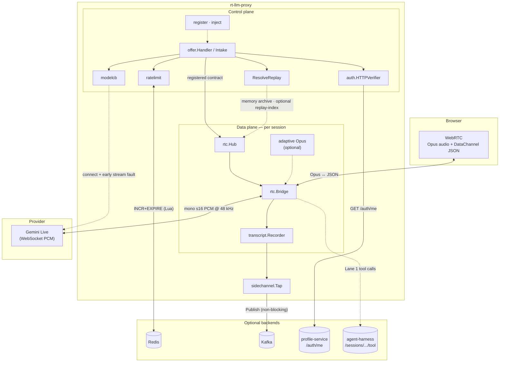
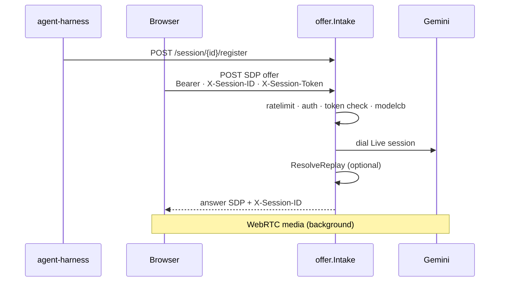

# Architecture & Engineering Notes

How rt-llm-proxy is put together. Kept deliberately small — this is a small
project scoped to **Gemini Live** for Auracle.

| § | Topic |
|---|---|
| **1** | Proxy core — WebRTC bridge, control plane, fault tolerance |
| **2** | Modules & seams |
| **3** | Engineering optimizations (pacing, Opus, replay, …) |
| **4** | Tests |

## 1. Architecture

**Invariant (load-bearing):** the control / personalization plane must never gate
the real-time media plane (§3.3). Fault tolerance degrades the feature, not the
call, unless the failure is an explicit hard guard (rate limit at capacity,
circuit open).

### 1.1 System overview



Solid arrows are on the hot path; dashed arrows are best-effort or optional.
Redis and Kafka are **never** on the 20ms audio loop.

### 1.2 Media data path

```
browser ──WebRTC(Opus audio + datachannel)──▶ rtc.Bridge ──▶ gemini adapter
        ◀──────────── Opus audio ────────────              ◀──── PCM ──────
```

- **Inbound:** `track.ReadRTP` → Opus decode → mono s16 PCM @48kHz →
  `Model.SendAudio`.
- **Outbound:** `Model.Recv` → Opus-encode 20ms frames → `WriteSample`, paced
  at real time (session `time.Ticker`, §3.1).
- **Data channel:** user text → `Recorder.Record("user")` + `Model.SendText`;
  provider STT → `Recorder.Record` → browser as `{seq,role,text}`.

### 1.3 Control & reconnect path



### 1.4 Fault tolerance & degradation

| Layer | Component | Trigger | Policy | Blocks media? |
|---|---|---|---|---|
| Control | `ratelimit` | Redis error | **Fail open** | No |
| Control | `ratelimit` | window full | `429` | Yes (offer only) |
| Control | `auth` | missing / invalid token | **Anonymous** | No |
| Control | registration | bad `X-Session-Token` | `403` | Yes (offer only) |
| Control | `modelcb` | circuit open | `503` + `Retry-After` | Yes (offer only) |
| Control | `ResolveReplay` | timeout / miss | `X-Replay-Status` degrade | No |
| Side | `sidechannel` | buffer full | **Drop** + metric | No |
| Data | `adaptive` | high load | Lower Opus complexity | No (quality tradeoff) |

Failover levels L1–L4: [README § Scaling](../README.md#scaling--failover),
[ADR 0001](adr/0001-l4-connection-migration-impractical.md).

## 2. Modules & seams

| Module | Package | Role |
|---|---|---|
| **Bridge** | `internal/rtc` | Terminates one WebRTC peer connection; pumps audio + data-channel text. Owns the **Recorder**. |
| **Session archive** | `internal/rtc` | In-memory reconnect archive (TTL + ownership). |
| **Transcript** | `internal/transcript` | `Line{seq,role,text}` — single seq authority. |
| **Session offer intake** | `internal/offer` | Rate limit, guard, registration, token check, replay, then `Hub.Serve`. |
| **Registration** | `internal/offer` | `POST /session/{id}/register` + `Registry` TTL store. |
| **Provider guard** | `internal/modelcb` | Per-provider circuit on offer path + early stream faults. |
| **Auth** | `internal/auth` | `HTTPVerifier` → profile-service `/auth/me`; fail-open anonymous. |
| **Model seam** | `internal/model` | `SendAudio` / `SendText` / `Recv` / `Close`. |
| **Gemini adapter** | `internal/model/gemini` | Gemini Live WebSocket protocol. |
| **Side-channel** | `internal/sidechannel` | Transcript events → Kafka/stdout. |
| **Replay index** | `internal/replayindex` | Optional cross-node replay HTTP client. |
| **Audio** | `internal/audio` | Opus + linear resampler (cgo). |
| **Rate limit** | `internal/ratelimit` | Redis fixed-window on offer only. |
| **Composition root** | `cmd/proxy` | Wires adapters; owns shutdown order. |

### Audio contract

**Every chunk crossing the Model seam is mono signed-16 PCM at 48 kHz.** The
gemini adapter converts to/from Gemini's wire format internally.

## 3. Engineering optimization points

### 3.1 Real-time outbound pacing *(rtc/bridge.go)*

Session-level `time.Ticker` — not per-frame `time.After` — prevents monotonic
latency growth on long responses.

### 3.2 Atomic rate limiting + fail-open *(ratelimit)*

Lua INCR+EXPIRE; Redis errors allow the offer (logged).

### 3.3 Redis stays on the control plane only

Never on the 20ms audio loop.

### 3.4 Shared pion MediaEngine *(rtc.Hub)*

Built once per process, reused per session.

### 3.5 Opus tuning for lossy links

Uplink fmtp: FEC + DTX + 16 kbps cap. Downlink encoder: FEC + DTX +
`PacketLossPerc=10`.

### 3.6 Non-trickle ICE, host candidates only

No STUN/TURN. Run on a host the browser can reach.

### 3.7 Lifecycle & backpressure

`sync.Once` cleanup; `CloseAll` on SIGTERM; RTCP drain goroutine; session
outlives the offer HTTP request.

### 3.8 Reconnect replay (best effort)

`X-Replay-Version: 1`, `X-Session-ID`, `X-Last-Seq` → memory archive first,
optional replay-index second (`-replay-timeout` 300ms default). Never blocks
media startup.

Gemini restores dialogue via `model.ContextRestorer` from replayed transcript
text.

### 3.9 Provider guard *(modelcb)*

Gates new dials; early stream faults within 10s before first audio.

### 3.10 Adaptive Opus complexity *(adaptive)*

`-adaptive sessions` recommended — proactive CPU shed under load.

## 4. Tests

- `internal/model/gemini` — audio + transcript decode
- `internal/offer` — intake, registration, token auth, replay resolution
- `internal/auth` — HTTPVerifier + fail-open Authenticator
- `internal/modelcb`, `internal/ratelimit`, `internal/rtc`, `internal/transcript`
- `internal/replayindex`, `internal/sidechannel`
